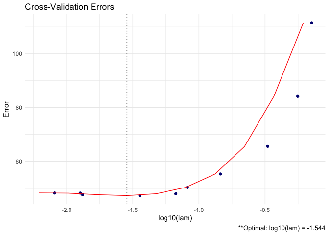
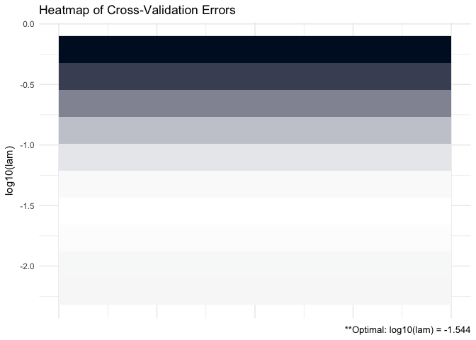

CVglasso
================

[](https://cran.r-project.org/package=CVglasso)

## Overview

`CVglasso` is an R package that estimates a penalized precision matrix
via block-wise coordinate descent – also known as the graphical lasso
(glasso) algorithm. This package is a simple wrapper around the popular
‘glasso’ package and extends and enhances its capabilities. These
enhancements include built-in cross validation and visualizations. A
(possibly incomplete) list of functions contained in the package can be
found below:

  - `CVglasso()` computes the estimated precision matrix

  - `plot.CVglasso()` produces a heat map or line graph for cross
    validation errors

See
[tutorial](https://mgallow.github.io/CVglasso/docs/articles/Tutorial.html)
or
[manual](https://github.com/MGallow/CVglasso/blob/master/CVglasso.pdf).

## Installation

``` r
# The easiest way to install is from CRAN
install.packages("CVglasso")

# You can also install the development version from GitHub:
# install.packages("devtools")
devtools::install_github("MGallow/CVglasso")
```

If there are any issues/bugs, please let me know:
[github](https://github.com/MGallow/CVglasso/issues). You can also
contact me via my [website](http://users.stat.umn.edu/~gall0441/). Pull
requests are welcome\!

## Usage

``` r
library(CVglasso)

# generate data from a sparse matrix
# first compute covariance matrix
S = matrix(0.7, nrow = 5, ncol = 5)
for (i in 1:5){
  for (j in 1:5){
    S[i, j] = S[i, j]^abs(i - j)
  }
}

# print oracle precision matrix (shrinkage might be useful)
(Omega = round(qr.solve(S), 3))
```

    ##        [,1]   [,2]   [,3]   [,4]   [,5]
    ## [1,]  1.961 -1.373  0.000  0.000  0.000
    ## [2,] -1.373  2.922 -1.373  0.000  0.000
    ## [3,]  0.000 -1.373  2.922 -1.373  0.000
    ## [4,]  0.000  0.000 -1.373  2.922 -1.373
    ## [5,]  0.000  0.000  0.000 -1.373  1.961

``` r
# generate 100 x 5 matrix with rows drawn from iid N_p(0, S)
set.seed(123)
Z = matrix(rnorm(100*5), nrow = 100, ncol = 5)
out = eigen(S, symmetric = TRUE)
S.sqrt = out$vectors %*% diag(out$values^0.5) %*% t(out$vectors)
X = Z %*% S.sqrt

# calculate sample covariance
Sample = (nrow(X) - 1)/nrow(X)*cov(X)

# print sample precision matrix (perhaps a bad estimate)
round(qr.solve(cov(X)), 5)
```

    ##          [,1]     [,2]     [,3]     [,4]     [,5]
    ## [1,]  2.30646 -1.53483  0.21884 -0.08521  0.24066
    ## [2,] -1.53483  3.24286 -1.66346 -0.14134  0.18760
    ## [3,]  0.21884 -1.66346  3.16698 -1.23906 -0.10906
    ## [4,] -0.08521 -0.14134 -1.23906  2.74022 -1.35853
    ## [5,]  0.24066  0.18760 -0.10906 -1.35853  2.03323

``` r
# GLASSO (lam = 0.5)
CVglasso(S = Sample, lam = 0.5)
```

    ## 
    ## 
    ## Call: CVglasso(S = Sample, lam = 0.5)
    ## 
    ## Iterations:
    ## [1] 3
    ## 
    ## Tuning parameter:
    ##       log10(lam)  lam
    ## [1,]      -0.301  0.5
    ## 
    ## Log-likelihood: -10.44936
    ## 
    ## Omega:
    ##          [,1]     [,2]     [,3]     [,4]     [,5]
    ## [1,]  1.34080 -0.00973  0.00000  0.00000  0.00000
    ## [2,] -0.00973  1.19263 -0.09615  0.00000  0.00000
    ## [3,]  0.00000 -0.09615  1.21895 -0.11424  0.00000
    ## [4,]  0.00000  0.00000 -0.11424  1.06968 -0.13534
    ## [5,]  0.00000  0.00000  0.00000 -0.13534  1.12473

``` r
# GLASSO cross validation
CVGLASSO = CVglasso(X, trace = "none")
CVGLASSO
```

    ## 
    ## 
    ## Call: CVglasso(X = X, trace = "none")
    ## 
    ## Iterations:
    ## [1] 3
    ## 
    ## Tuning parameter:
    ##       log10(lam)    lam
    ## [1,]      -1.544  0.029
    ## 
    ## Log-likelihood: -110.16675
    ## 
    ## Omega:
    ##          [,1]     [,2]     [,3]     [,4]     [,5]
    ## [1,]  2.13225 -1.24667  0.00000  0.00000  0.18710
    ## [2,] -1.24669  2.75120 -1.29907 -0.07345  0.00000
    ## [3,]  0.00000 -1.29915  2.81735 -1.15679 -0.00114
    ## [4,]  0.00000 -0.07339 -1.15673  2.46461 -1.17086
    ## [5,]  0.18707  0.00000 -0.00116 -1.17087  1.86326

``` r
# produce line graph for CV errors for GLASSO
plot(CVGLASSO)
```

<!-- -->

``` r
# produce CV heat map for GLASSO
plot(CVGLASSO, type = "heatmap")
```

<!-- -->
