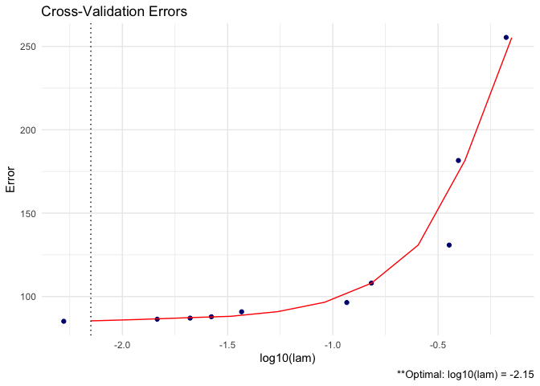
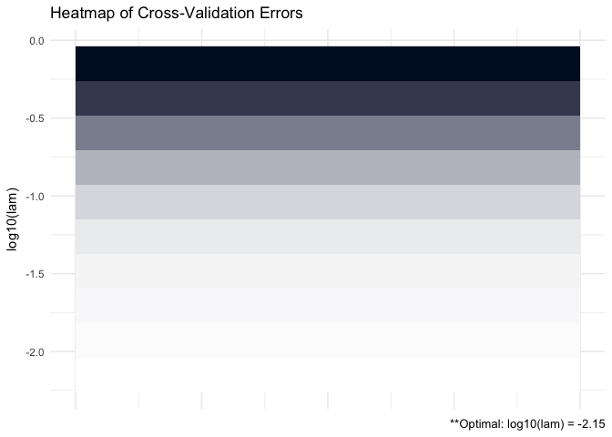

CVglasso
================

Overview
--------

<br>

<p align="center">

</p>
<br>

`CVglasso` is an R package that estimates a penalized precision matrix via block-wise coordinate descent -- also known as the graphical lasso (glasso) algorithm. This package is a simple wrapper around the popular 'glasso' package and extends and enhances its capabilities. These enhancements include built-in cross validation and visualizations. A (possibly incomplete) list of functions contained in the package can be found below:

-   `CVglasso()` computes the estimated precision matrix

-   `plot.CVglasso()` produces a heat map or line graph for cross validation errors

See [vignette](https://mgallow.github.io/CVglasso/) or [manual](https://github.com/MGallow/CVglasso/blob/master/CVglasso.pdf).

Installation
------------

``` r
# The easiest way to install is from CRAN
install.packages("CVglasso")

# You can also install the development version from GitHub:
# install.packages("devtools")
devtools::install_github("MGallow/CVglasso")
```

If there are any issues/bugs, please let me know: [github](https://github.com/MGallow/CVglasso/issues). You can also contact me via my [website](http://users.stat.umn.edu/~gall0441/). Pull requests are welcome!

Usage
-----

``` r
library(CVglasso)

# generate data from a sparse matrix
# first compute covariance matrix
S = matrix(0.7, nrow = 5, ncol = 5)
for (i in 1:5){
  for (j in 1:5){
    S[i, j] = S[i, j]^abs(i - j)
  }
}

# print oracle precision matrix (shrinkage might be useful)
(Omega = qr.solve(S) %>% round(3))
```

    ##        [,1]   [,2]   [,3]   [,4]   [,5]
    ## [1,]  1.961 -1.373  0.000  0.000  0.000
    ## [2,] -1.373  2.922 -1.373  0.000  0.000
    ## [3,]  0.000 -1.373  2.922 -1.373  0.000
    ## [4,]  0.000  0.000 -1.373  2.922 -1.373
    ## [5,]  0.000  0.000  0.000 -1.373  1.961

``` r
# generate 1000 x 5 matrix with rows drawn from iid N_p(0, S)
Z = matrix(rnorm(100*5), nrow = 100, ncol = 5)
out = eigen(S, symmetric = TRUE)
S.sqrt = out$vectors %*% diag(out$values^0.5) %*% t(out$vectors)
X = Z %*% S.sqrt

# calculate sample covariance
Sample = (nrow(X) - 1)/nrow(X)*cov(X)

# print sample precision matrix (perhaps a bad estimate)
(qr.solve(cov(X)) %>% round(5))
```

    ##          [,1]     [,2]     [,3]     [,4]     [,5]
    ## [1,]  1.85086 -1.37811 -0.21133  0.36663 -0.06197
    ## [2,] -1.37811  3.06336 -1.02144  0.04938 -0.41023
    ## [3,] -0.21133 -1.02144  2.95711 -1.82790  0.60780
    ## [4,]  0.36663  0.04938 -1.82790  3.73047 -2.16588
    ## [5,] -0.06197 -0.41023  0.60780 -2.16588  2.70455

``` r
# GLASSO (lam = 0.5)
CVglasso(S = Sample, lam = 0.5)
```

    ## 
    ## 
    ## Call: CVglasso(S = Sample, lam = 0.5)
    ## 
    ## Iterations:
    ## [1] 4
    ## 
    ## Tuning parameter:
    ##       log10(lam)  lam
    ## [1,]      -0.301  0.5
    ## 
    ## Log-likelihood: -10.15419
    ## 
    ## Omega:
    ##          [,1]     [,2]     [,3]     [,4]     [,5]
    ## [1,]  1.04401 -0.07670  0.00000  0.00000  0.00000
    ## [2,] -0.07670  1.34189  0.00000  0.00000  0.00000
    ## [3,]  0.00000  0.00000  1.31003 -0.03553  0.00000
    ## [4,]  0.00000  0.00000 -0.03553  1.17809 -0.17864
    ## [5,]  0.00000  0.00000  0.00000 -0.17864  1.21509

``` r
# GLASSO cross validation
CVglasso(X, trace = "none")
```

    ## 
    ## Optimal tuning parameter on boundary... consider providing a smaller lam value or decreasing lam.min.ratio!

    ## 
    ## 
    ## Call: CVglasso(X = X, trace = "none")
    ## 
    ## Iterations:
    ## [1] 2
    ## 
    ## Tuning parameter:
    ##       log10(lam)    lam
    ## [1,]      -2.202  0.006
    ## 
    ## Log-likelihood: -92.0578
    ## 
    ## Omega:
    ##          [,1]     [,2]     [,3]     [,4]     [,5]
    ## [1,]  1.82709 -1.35205 -0.17851  0.29388 -0.01755
    ## [2,] -1.35206  3.00780 -0.97193  0.00000 -0.35903
    ## [3,] -0.17848 -0.97194  2.84067 -1.64120  0.44909
    ## [4,]  0.29381  0.00000 -1.64113  3.51504 -2.00699
    ## [5,] -0.01750 -0.35901  0.44902 -2.00697  2.61284

``` r
# produce CV heat map for GLASSO
CVGLASSO = CVglasso(X, trace = "none")
CVGLASSO %>% plot
```



``` r
# produce line graph for CV errors for GLASSO
CVGLASSO %>% plot(type = "heatmap")
```


